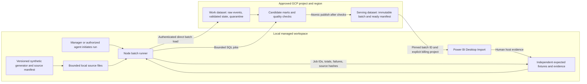

# OPP-02 solution architecture

Version: **v1.0 — proposed for Gate 4**. Prepared: **2026-09-20 America/Chicago**. Run: HDG-20260920-01. Decision owner: Human Manager. Basis: the approved OPP-02 [charter v1.1](../project-charter.md) and [Gate 3](../gates/gate-3-project-selection.md). This is architecture documentation; no implementation, provisioning, installation or connectivity test is claimed.

## Recommendation and management choices

Use an explicitly initiated **local Node.js batch runner**, **BigQuery** for the deployed analytical backend, and an **unpublished Power BI Desktop Import report**. Existing Node 24 is usable locally; SDK, authentication and report-host compatibility remain verification conditions. The manager reports that Power BI is installed, a new GCP project is needed, the desired region is “East US,” and none of the approximately $30/month allowance is used. These are user-provided facts, not a tested connection, exact GCP region selection or project-creation authorization. Cloud Run, Cloud Scheduler, Cloud Storage, an always-on server and Power BI Service are outside the proposed baseline. The meaningful engineering work remains event reconciliation, repeatability, independent correctness, controlled publication and verified report behavior.

Request three management decisions at [Gate 4](../gates/gate-4-architecture.md):

1. **Operating cadence:** accept an operator-initiated update once on each active demonstration day, followed by Desktop refresh, with visible source-as-of and stale-state information. This is an explicit interpretation of the charter's daily lab update, **not an unattended daily service**. No update is promised when the sole operator is absent. If unattended daily backend operation is required, select and re-cost the managed alternative below before implementation; Desktop refresh would still require a separate supported solution or human action.
2. **Resource, cost and access envelope:** approve only the named projects/region, lab resources, identities and limits in the [proposed envelope](../operations/execution-envelope.md), once the new project, actual billing linkage and access are established. The manager reports the full approximately $30/month GCP allowance is unused; keep headroom rather than treating the allowance as a target or an enforced ceiling. Standing ChatGPT Pro is excluded; no publication/capacity purchase is proposed.
3. **Proportionate delivery controls:** accept credential-free automated validation, versioned declarative resource definitions with a repeatable local apply procedure, and separately authorized cloud execution plus human Desktop verification. Accept the documented single-operator/recovery limitations; select a supported PBIP workflow only after the host checks below. Neither a workflow file nor generated report files establish successful execution.

Gate 4 approval permits Phase 5 detailed design, but its prerequisite capability conditions must first be resolved as recorded in the gate package. Gate 5 must approve the data/analytics baseline before implementation. A separately proposed, tightly bounded project/billing/IAM bootstrap can establish missing prerequisites only with explicit authority; this architecture does not authorize that action or a pre-Gate-5 data/query/report proof.

## Components and trust boundaries

All component names are proposed logical names. Propose a new dedicated project with an available `astra-po-lab-...` ID and **`us-east4` (Northern Virginia)** as an explicit interpretation of the manager's “East US” preference; the exact ID and region decision remain unconfirmed. Google's [location list](https://docs.cloud.google.com/bigquery/docs/locations) identifies that region. Actual billing linkage, dataset names, runtime service-account identifier and Desktop principal also remain unresolved in the envelope. One lab environment and two dataset permission boundaries are sufficient: work/raw/validation versus report-serving. Table/partition retention and any additional transient resources must stay inside the same envelope.

Google supports loading local files directly through BigQuery's API/client libraries; a Cloud Storage staging bucket is not inherently required. The Node client provides asynchronous local-file load jobs. Use the maintained `@google-cloud/bigquery` package, select a compatible release and lock dependencies during authorized implementation; no unverified SDK version is pinned here. [Batch-load documentation](https://docs.cloud.google.com/bigquery/docs/batch-loading-data), [Node Table API](https://docs.cloud.google.com/nodejs/docs/reference/bigquery/latest/bigquery/table), [Node client support](https://docs.cloud.google.com/nodejs/docs/reference/bigquery/latest).

## Ingestion, correctness and publication

The following are architectural invariants; exact schemas, PO/receipt/cancellation/promise rules, fixture values and tolerances remain Gate 5 decisions.

1. **Reproducible input:** generate bounded canonical synthetic events locally from a versioned specification/seed. Hash source files and record provenance, source cutoff and schema version. Keep a small independently calculated fixture separate from generator and transformation logic. Public reference data is optional and requires provenance/usage review.
2. **Controlled admission:** validate file/schema shape before upload; retain source evidence and quarantine reasons. Explicit schemas avoid silent type inference. A malformed or semantically invalid batch cannot publish unless its handling is permitted by the Gate 5 contract; no silent row-dropping to obtain green checks.
3. **Raw and validated separation:** append identifiable source events into the work boundary; derive canonical PO state using stable event/business identifiers and approved correction precedence. Incremental batches, duplicate arrivals and late corrections are demonstrated without deleting their audit trail. The small serving snapshot may be rebuilt per batch: full snapshot publication is compatible with incremental event ingestion and avoids premature optimization.
4. **Idempotent orchestration:** one active runner per lab. Persist run/batch IDs, source hashes and BigQuery job IDs. On a network timeout, inspect the existing job before retrying; a retry does not blindly append the same input. An identical already-published batch is a verified no-op. A correction produces a new candidate batch and revalidation.
5. **Quality before visibility:** compare identities, quantities, omitted/duplicated events and independently expected exceptions. Build candidates without changing the last accepted serving batch. Publish pre-created serving tables and the ready-manifest entry in a bounded DML transaction only after checks succeed; failure leaves the preceding published batch available. BigQuery supports atomic multi-statement DML transactions, but permanent-table DDL is outside the transaction, so resource creation belongs to setup. [BigQuery transactions](https://docs.cloud.google.com/bigquery/docs/transactions).
6. **Consistent report import:** every serving row has an immutable published batch identity. Before refresh, the operator fixes one report batch parameter to a ready batch from the manifest; all Import queries use it. Reading a changing “latest” pointer separately for each report table is insufficient. Published data for that batch is not modified; any repair creates a new batch. The report shows batch/source-as-of and refresh context, with stale behavior designed at Gate 5 and validated in Desktop.

## Authentication, configuration and security

Use keyless local Application Default Credentials, preferably impersonating one narrowly scoped runtime service account. Node supports this route; the human needs the corresponding impersonation permission on that service account. A supported local login/CLI route still needs verification: `gcloud`/`bq` are not on the inspected PATH and no GCP connector is available. No service-account key file, access token or credential-bearing evidence enters the repository or report. [BigQuery authentication](https://docs.cloud.google.com/bigquery/docs/authentication).

| Principal / purpose | Proposed boundary, pending actual access verification |
|---|---|
| Manager/bootstrap | A specifically authorized identity creates/links the dedicated project and establishes only approved lab APIs, resources and scoped role bindings. Required billing/project-creation authority must be verified. Do not grant broad Owner/Editor merely to bypass failures; setup authority is separate from runtime authority. |
| Runtime service account | `roles/bigquery.jobUser` on the explicit execution project; `roles/bigquery.dataEditor` on the two lab datasets. No project-wide data editing. Human impersonation is scoped to this account. |
| Desktop reader | Manager's Google OAuth identity; `roles/bigquery.dataViewer` on serving data and `roles/bigquery.jobUser` on the explicit billing project. Add only verified connector-required metadata/read-session permissions. |

These role proposals use the current [BigQuery role definitions](https://docs.cloud.google.com/bigquery/docs/access-control). If the manager's existing identity already has broader rights, record the effective access and residual risk; a read-only report query does not reduce IAM privileges. Do not create a second human participant to claim separation of duties.

Keep project, billing project, region, dataset IDs, limits and nonsecret parameters in validated environment configuration, distinct from code and secrets. Treat the local workstation/credential store and GCP as separate trust boundaries; synthetic data is still labeled and access-scoped. Credential/session caches and imported data caches stay out of Git. No public endpoint, actual supplier communication or production data is required.

## Power BI connection and verification

Use **Import**, the explicit billing project, and Google-user OAuth. The detailed connector implementation, permissions, host version, artifact format and verification procedure are in [Power BI integration](power-bi-integration.md). Microsoft's connector supports Import and DirectQuery; this architecture chooses Import so report interaction operates on the loaded batch rather than repeatedly issuing warehouse queries. This is a design choice, not observed performance. [BigQuery connector](https://learn.microsoft.com/en-us/power-query/connectors/google-bigquery).

Do not assume a connector-created temporary dataset, Storage Read API call or project enumeration is within existing authority. The first proof must record actual jobs/resources and resolve any additional access/location requirement within the envelope. No blanket dataset-creation grant or cross-region default is implied.

Prefer the existing PBIP/PBIR/TMDL source structure if the installed Desktop version supports it. Microsoft's current documentation still labels PBIP saving preview; verify enabled features, supported external edits and local save-path limits. A fallback format or material authoring exception must be documented before dependent work, rather than silently abandoning reproducible source. Existing user artifacts remain preserved. [Power BI projects](https://learn.microsoft.com/en-us/power-bi/developer/projects/projects-overview).

The manager's About evidence identifies **August 2026 Desktop 2.157.1354.0 x64**, with the relevant PBIP/TMDL/PBIR preview features enabled, and confirms normal launch with no error. This supports C3-02 closure review with the documented human procedure; actual connector/PBIP behavior is still to be tested after Gate 5. Legacy BigQuery ODBC is currently disabled: any fallback requires supported-build evidence and an explicit decision on enabling it. Current native/browser-control attempts do not provide a working automation surface; plan named human host checks, not unattended UI automation.

After Gate 5, the first implementation slice proves one small fixture through the actual local runner, BigQuery, pinned-batch Import, calculation, Desktop rendering and refresh. Retain the manager's host evidence. Stop expansion if the route fails; generated files or documentation are not substitutes.

## Operations, recovery and cost controls

The manager owns continuing operation; the agent may run approved commands during active sessions. The runbook will sequence source generation/admission, backend publication, explicit Desktop batch selection/refresh, verification and evidence capture. No unattended agent, Windows scheduled task or cloud scheduler is assumed.

Log sanitized structured stage outcomes, run/batch identifiers, source revision/hashes, BigQuery job IDs, row/quantity reconciliation and errors locally; retain durable summaries and cloud job references. A failed run returns a clear failure and leaves the last good batch available. The operator checks outcome and source-as-of before use; automatic alert delivery while the operator is absent is not promised. Any email/chat alert destination needs a separate authorized route.

Recovery means diagnosing the failed stage, checking existing jobs before retry, rebuilding from retained deterministic sources, and selecting a verified prior batch when appropriate. Demonstrate interrupted load, malformed batch, repeat/correction and rollback-to-prior-batch behavior at the approved scale. Maintain current/prior serving batches only within retention/storage bounds; recover older evidence from manifests/fixtures when possible rather than promising indefinite rollback.

The [execution envelope](../operations/execution-envelope.md) owns all proposed numerical limits, pricing assumptions, retention, retry bounds and cleanup authority. Enforce allowed targets and workload sizes in the runner; use dry-run estimates and `maximumBytesBilled` for supported query jobs. This API control bounds billed bytes for that job, not total account spend. Desktop-generated jobs need separately verified controls; billing lag and other account activity remain risks. [BigQuery query-job configuration](https://docs.cloud.google.com/bigquery/docs/reference/rest/v2/Job#JobConfigurationQuery).

At release, record the approved source/configuration/report revision, published batch, target, successful checks and cleanup owner. Remove or retain only identified lab resources under explicit authority; never delete a shared project, disable billing or alter unrelated quotas as an improvised cost stop.

## Alternatives and proportionality

| Route | Benefit | Cost/ownership implication and disposition |
|---|---|---|
| Local Node batch directly to BigQuery — recommended | Reuses verified runtime, small service footprint, traceable explicit execution | Relies on workstation, login and operator; no unattended freshness guarantee. Accept that limit explicitly. |
| Cloud Run Jobs + Cloud Scheduler + Cloud Storage staging | Managed backend scheduling and service identity; durable input location | Adds job/container build and registry lifecycle, schedule/retry ownership, bucket/retention and permissions. Exact incremental cost depends on approved workload; no unsupported quote is asserted. Does not automatically refresh an unpublished Desktop report. Reconsider if unattended backend execution has a required benefit. |
| Always-on VM/orchestration service | Persistent runtime and broad flexibility | Disproportionate administration and exposure for one bounded batch; no identified requirement justifies it. |
| Local-only workbook/report | Removes cloud execution burden | Changes the approved deployed GCP/BigQuery endpoint; valid only through an explicit affected-gate change. |

Google documents scheduled Cloud Run jobs through Cloud Scheduler; this establishes an available alternative, not configured access or deployment in this lab. [Scheduled jobs](https://docs.cloud.google.com/run/docs/execute/jobs-on-schedule). The [ADR](../decisions/adr-001-lab-architecture.md) records the proposed decision and reversal triggers.

## Delivery controls and engineering-principles assessment

After Gate 5, build a small validation pipeline: locked dependency install; static/config/schema checks; generator and runner tests; independent fixture comparisons; secret/dependency checks; and report metadata/schema validation where supported. CI contains **no GCP credentials** and performs no automatic cloud deployment. Successful CI must be demonstrated. Authorized local BigQuery integration jobs and human Desktop checks supply evidence CI cannot provide.

Use versioned declarative dataset/table/IAM specifications plus a repeatable plan/apply and cleanup procedure, implemented only after approval. An apply operation must validate exact project/region/resource targets, present changes and retain output; it must fail on unexpected drift rather than overwrite unrelated resources. Do not build a general infrastructure framework. Terraform is an alternative if it reduces total setup/state burden; its presence alone does not make it preferable. Record actual resource/configuration hashes and CI/source revisions for each cloud execution.

| Principle | Proposed application and evidence required | Limitation / proposed exception |
|---|---|---|
| Secure by Design | Keyless scoped runtime, explicit targets, sanitized logs, dependency/secret checks, verified reader permissions | Same human administers and verifies; no independent security certification or artificial separation of duties |
| TDD | Approve independent expected cases first; automate business-rule, lifecycle, idempotence and failure tests; retain failed attempts | Generator output cannot be its own correctness oracle |
| DevSecOps | Source-controlled code/config/SQL/report, dependency lock, security checks and evidence linked to revision | Every proposed control remains Not Run until executed |
| CI/CD | Automated credential-free validation; repeatable but separately authorized cloud apply/release; actual CI and cloud evidence | No unattended delivery or cloud-secret-bearing CI; hosted checks do not prove Desktop behavior |
| Twelve-Factor where useful | Declared dependencies, external config, restartable bounded jobs, event logs, reproducible admin commands | Local execution depends on host/login; no artificial application-service architecture around SQL/report assets |
| UI/UX | Decision-first exception summary and line/event explanation, visible provenance/as-of/error state; three charter buyer tasks | Final wireframes and interactions remain Gate 7 decisions |
| Accessibility | Contrast, meaningful labels, keyboard/tab order, non-color cues and supported alternative text checked in Desktop | Platform/host limits documented; generated metadata is insufficient evidence |

The proposed operating cadence, manual release/host checks and lightweight infrastructure approach are proportionality decisions, not waivers of correctness, cost authority or all nine gates. Gate 4 records accepted exceptions. Gate 5 still defines precise analytics meaning and acceptance thresholds.
